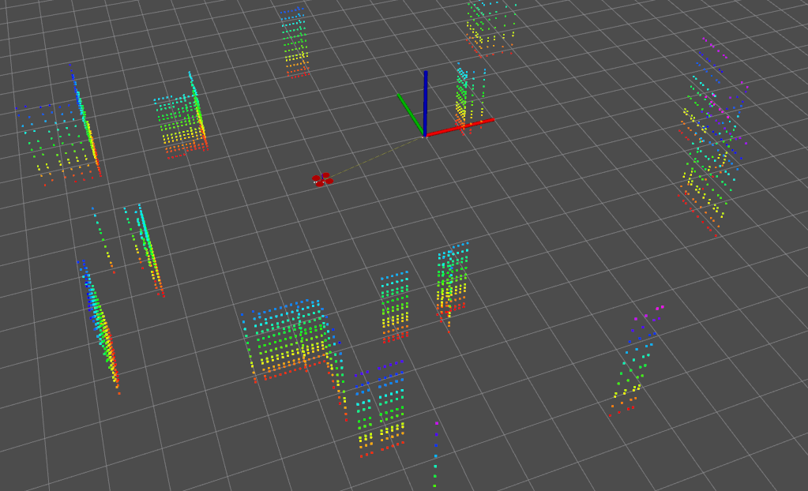

# laser_simulator
A laser simulator rospackage.

Takes in a global point cloud map, and output the observed point cloud in _laser coordinate_ according to the input odometry.

  

## Usage
Change the __odom_topic__ and __map_topic__ in __/launch/params.yaml__ to fit your own.

Tunable parameters are described in __/launch/params.yaml__.

## Example
After building, in two separate terminal, run 

$ roslaunch laser_simulator laser_sim.launch

$ roslaunch laser_simulator play_bag.launch

and you will see

  

GPU version on the way...